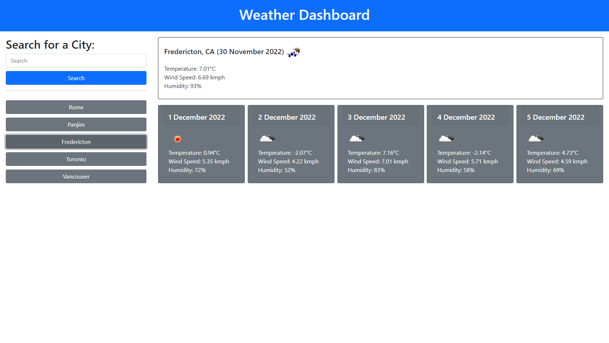

# Weather-Dashboard

##Description

A weather forecast application that processes the city entered and provides you with the present weather and the forecasted weather for the next 5 days. It also stores the cities entered in local storage for easy access to previously searched cities.

##Usage

Provides a user with present weather conditions and the weather as of 12 noon for the next 5 days for the entered city.

##Credits

JQuery
Bootstrap
W3Schools
Stackoverflow
OpenWeatherMap.org

##Screenshot

 
##Link to deployed application

https://mdpais.github.io/Weather-Forecast/

##License

None